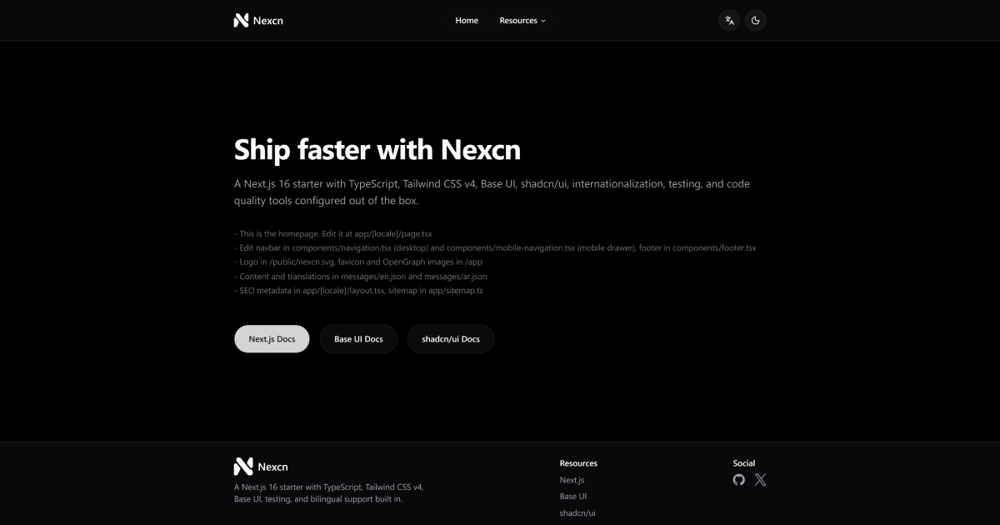

# Nexcn Starter



A production-ready Next.js boilerplate with internationalization, testing, and modern tooling.

## Quick Start

```bash
# 1. Install dependencies
pnpm install

# 2. Run development server
pnpm dev
```

Open [http://localhost:3000](http://localhost:3000) to view the application.

## Documentation

We have comprehensive guides available in the `Docs/` folder. We recommend reading them in order:

1. **[Getting Started](./Docs/01-getting-started.md)**
2. **[Project Structure](./Docs/02-project-structure.md)**
3. **[Styling Guide](./Docs/03-styling-guide.md)**
4. **[Adding Components](./Docs/04-adding-components.md)**
5. **[Internationalization](./Docs/05-internationalization-guide.md)**
6. **[Testing Guide](./Docs/06-testing-guide.md)**
7. **[Cheat Sheet](./Docs/07-cheat-sheet.md)**

## Tech Stack

- **Framework**: Next.js 16 (App Router)
- **Language**: TypeScript
- **Styling**: Tailwind CSS v4 + Base UI
- **i18n**: next-intl
- **Testing**: Vitest + Playwright
- **Linting**: ESLint + Prettier

## Deployment

To deploy for production:

```bash
pnpm build
pnpm start
```

## Contributing

Fork the repository, create a feature branch, and submit a PR. Licensed under MIT.
