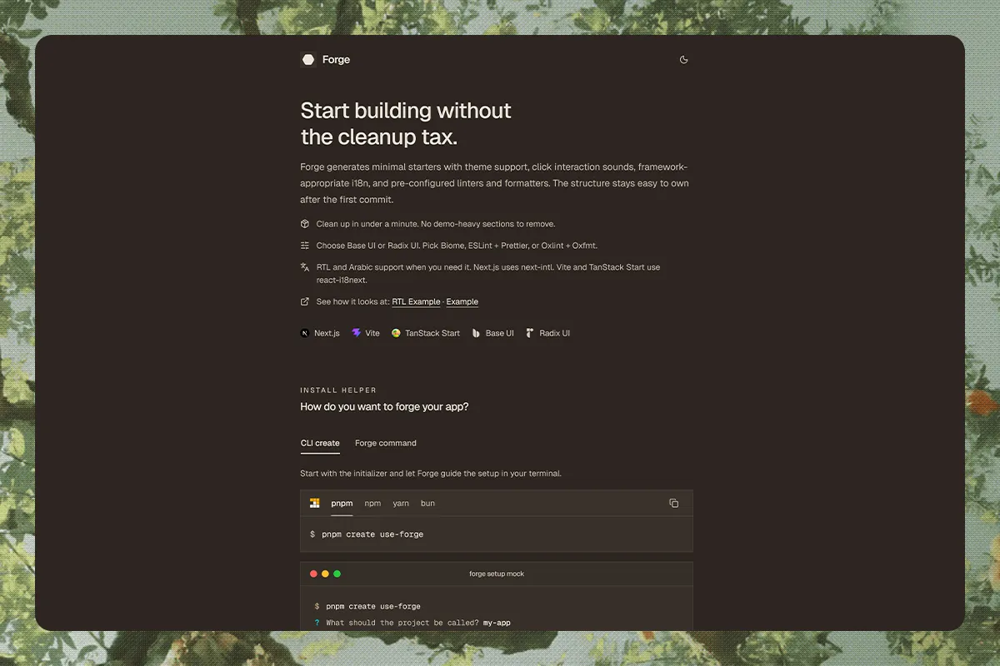

# Forge

Forge is a CLI that generates clean React starters for teams who want to begin with the app shell already wired.

It combines a shadcn scaffold with Forge-owned setup for theme switching, optional RTL routing, framework-specific i18n, sound hooks, fallback pages, metadata, code-quality tooling, and starter documentation. The generated app stays intentionally small so it is easy to understand and replace.

## Create an app

The published initializer package is named `create-use-forge`. Once the current package release has been published and registry-verified, use one of these commands:

```bash
npm create use-forge@latest
pnpm create use-forge
bun create use-forge
yarn create use-forge
```

Do not use `npm i create-use-forge` as the initializer command. That installs the package without running the generator.

## What Forge generates

Every generated starter includes:

- a minimal editable starter page
- theme switching
- framework-native error and not-found surfaces
- favicon and minimal metadata
- centralized click and theme-switch sound hooks
- a README with commands for the selected package manager
- one selected lint and format setup

RTL mode additionally includes English and Arabic locale routes, a language switch, and runtime `lang`/`dir` handling:

- Next.js uses `next-intl`
- Vite uses `react-i18next`
- TanStack Start uses `react-i18next`

## Choose a setup

| Option          | Supported values                           |
| --------------- | ------------------------------------------ |
| Framework       | `next`, `vite`, `start`                    |
| UI primitives   | `base`, `radix`                            |
| Direction       | `--ltr` or `--rtl`                         |
| Package manager | `pnpm`, `npm`, `yarn`, `bun`               |
| Code quality    | `biome`, `eslint-prettier`, `oxlint-oxfmt` |

`start` means TanStack Start. The default configuration is Next.js, Base UI, LTR, pnpm, and Biome.

Project names use lowercase letters, numbers, and single hyphens. The special name `.` generates into the current empty directory.

## Direct CLI usage

Run Forge interactively from source:

```bash
pnpm dev
```

Preview a generation plan without writing files:

```bash
pnpm dev -- plan --framework next --base base --ltr
```

Generate directly from flags:

```bash
pnpm dev -- generate \
  --name my-app \
  --framework next \
  --base base \
  --ltr \
  --package-manager pnpm \
  --code-quality biome
```

Generate a retained regression fixture:

```bash
pnpm dev -- generate --fixture \
  --name next-base-ltr \
  --framework next \
  --base base \
  --ltr
```

After building the package, the same commands are available through `forge` or `create-use-forge`:

```bash
pnpm build
node dist/index.js --help
```

## How the generator works

Forge is a single-package TypeScript CLI built around three layers:

1. The scaffold adapter invokes the current shadcn scaffold for the selected framework and primitive base.
2. A framework overlay adds the app shell, routing, providers, fallback surfaces, and framework-specific files.
3. Feature packs add shared concerns such as sounds, metadata, docs, dependency freshness, CSS polish, RTL runtime behavior, and code quality.

Generated projects are verified after generation. The verification flow runs the selected package manager’s install, formatting, lint, format check, typecheck, and build commands. TanStack Start builds before typechecking because its route tree is generated during the build flow.

Retained fixtures under [`fixtures/`](./fixtures) are generated outputs used as regression targets, not hand-maintained template copies.

## Development

Requirements:

- Node.js `>=20.19.0`
- pnpm `10.29.3` for the Forge repository

Install dependencies and run the core checks:

```bash
pnpm install --frozen-lockfile
pnpm typecheck
pnpm test
pnpm build
pnpm format:check
```

Inspect the package that would be published:

```bash
npm pack --dry-run
```

Local tarball smoke tests should use `npm exec --package <tarball>` rather than `npm create <tarball>`.

## Repository map

```txt
src/                 CLI, configuration, scaffolding, overlays, features, and verification
assets/branding/     Assets copied into generated applications
fixtures/            Generated regression fixtures
marketing-site/      Separate Next.js marketing site
spec/                Product contracts, implementation notes, and release documentation
```

The main contracts are:

- [Generator contract](./spec/generator-contract.md)
- [CLI experience](./spec/cli-experience.md)
- [Dependency freshness](./spec/dependency-freshness.md)
- [Release and publishing](./spec/release-and-publishing.md)
- [Project context](./spec/context.md)

## Marketing site

The marketing site lives in [`marketing-site/`](./marketing-site) and is deployed separately from the CLI package.

Run its local checks with:

```bash
pnpm --dir marketing-site typecheck
pnpm --dir marketing-site lint
pnpm --dir marketing-site build
```

Its production domain is [use-forge.vercel.app](https://use-forge.vercel.app/). Vercel should use `marketing-site/` as the project root.

## Current release status

The root package is prepared as `create-use-forge` version `0.1.4`, with MIT licensing, both CLI binaries, a narrow npm files allowlist, and local typecheck, test, build, packaging, and tarball smoke-test coverage documented in the release checklist.

The remaining public release work is npm publishing followed by registry verification of the initializer commands.

## License

Forge is released under the [MIT License](./LICENSE).
